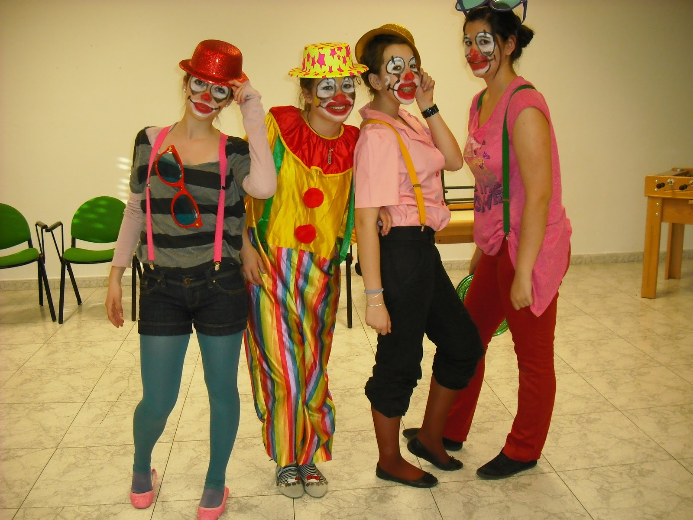

# gordo
:clown_face:

<!DOCTYPE html>
<html lang="en">
<head>
    <meta charset="UTF-8">
    <meta name="viewport" content="width=device-width, initial-scale=1.0">
    <link rel="stylesheet" href="progrm.css">
    <title>Document</title>
</head>
<body>

    <h1>Circo</h1>

    <h2>Bailarinas</h2>
    <h2>Acrobatas</h2>
    <h2>Malabaristas</h2>
    <h2>Magia</h2>
    <h2>Ayudantes de material</h2>

    
Lo más divertido del circo

    <strong>Bailan</strong> 
    <em>Ríen todos</em> 
    <small>Saltos dinámicos</small> 
    <mark>Objetos flotantes</mark> 
    <del>Ocultación de objetos</del> 
    <ins>Sillas mesas</ins> 
    <ins>Materiales de trabajo</ins> 
    Facilidad de movimiento

    <ul>
        <li>Ni idea1</li>
        <li>Con ideas2</li>
        <li>Faltan idea3</li>
    </ul>

    <ol>
        <li>Qué se va a ser</li>
        <li>Lo que es</li>
        <li>Lo mejor</li>
    </ol>

    <dl>
        <dt>Muestra</dt>
        <dd>Mostrario</dd>
        <dt>Mostrario de función</dt>
    </dl>

    <a href="http://example.com">HAGA CLICK</a>
    <a href="https://example.com" target="_blank">DOCUMENTO</a>
    <a href="mailto:example@example.com">CORREO ELECTRONICO</a>
    <a href="#section1">NUEVA SECCION</a>

    
    

</body>
</html>
